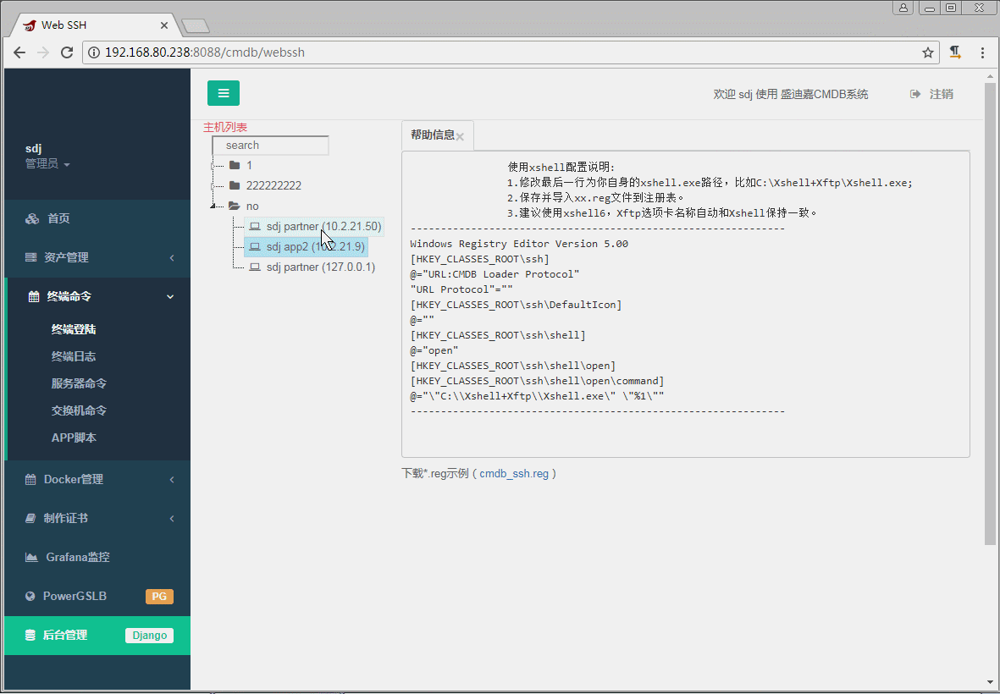
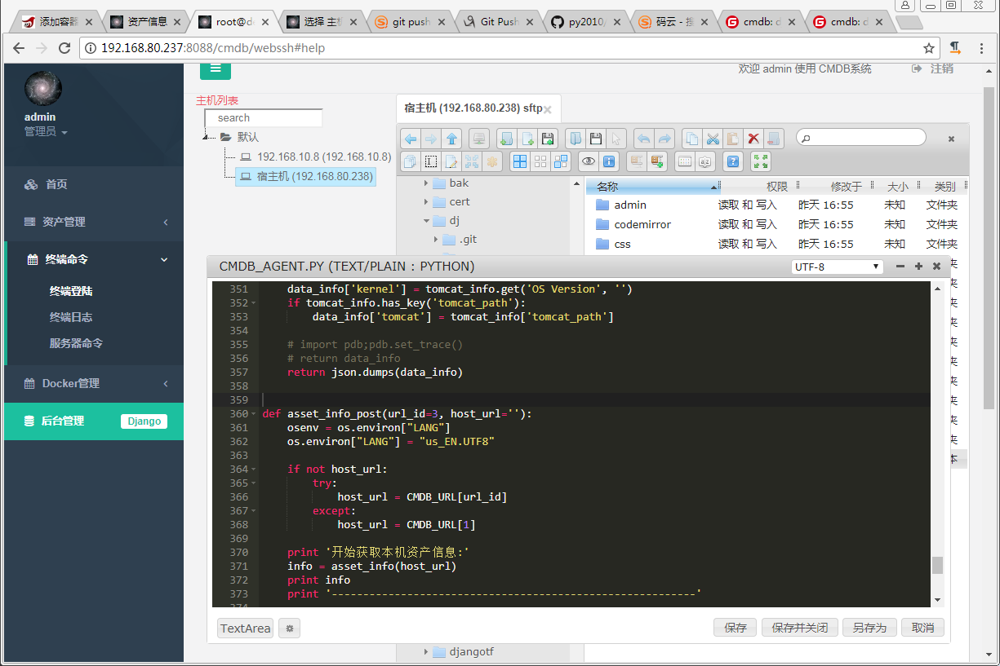
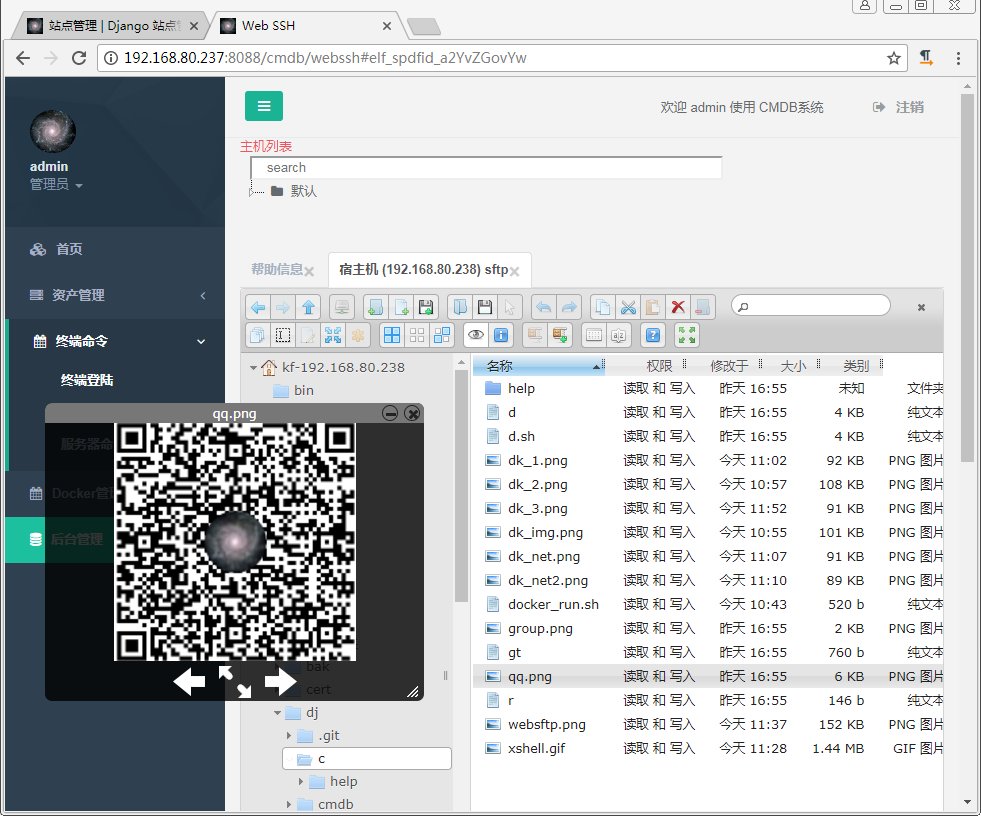

# python堡垒机

项目最开始是在2019年初从cmdb中拆出来的堡垒机功能, 那时是python2.7的版本, 后来cmdb改成了python3.6版本,
但github一直是py2.7的, py老版本不怎更新好多人来问, 改起来重复劳动/繁烦, 后来就删掉了. 这次重新拆出整理了下最新的.

* 功能:

        基于django、python3.6开发。
        1. SSH堡垒机 (纯py开发, 全部开源, 详细注释)
            webssh, websftp, 网站跳转到Xshell/Xftp, 上传下载, 终端录像/播放.
            堡垒机/软件终端, 需在客户端电脑配置Xshell/SecureCRT.
        2. 远程桌面/VNC (依赖guacamole服务端)
            只支持网页方式, webrdp, webvnc, 上传下载(blog方式), 不支持堡垒机功能(软件客户端接入方式)
        3. 其它的功能自己研究

* 环境：

        linux
        python3.6
        django2.2

* 部署：

        容器部署方式 (linux宿主机)
        git clone https://github.com/py2010/dx
        太慢的话, 可使用国内码云
        git clone https://gitee.com/py2010/dx
        cd dx
        docker-compose up
        等待自动部署完成, 当前目录-宿主机项目已挂载到容器/opt/dx, 方便修改/测试
        访问http://ip:8066，用户名/密码：admin/admin2021

        # 如果未安装docker-compose, 也可直接使用docker命令, 就是不能智能挂载目录,
        # pull拉取, 镜像大小108MB
        docker pull py2010/dx
        docker run -it --network host -v /宿主机路径/dx:/opt/dx host py2010/dx
        # 如果不挂载宿主机项目/opt/dx/, 则自动使用镜像中的目录/dx/
        # 远程桌面/VNC 依赖guacamole/guacd, 如果只需SSH可以不用.
        docker run --name guacd --restart=always --net=host -v /宿主机路径/dx/media:/guacamole guacamole/guacd:1.2.0

        其它部署方式
        pip3 install -r requirements.txt, 除了guacamole为容器时注意挂载目录, 其它都比较简单, 参考容器了解, 略

* app模块：
    1. apps/cmdb 网站界面, websocket, webssh
    2. apps/elfinder websftp
    3. apps/generic django通用视图/模板
    4. apps/guacamole 远程桌面/VNC客户端
    5. apps/term SSH堡垒机, Xshell等软件终端
    6. config 配置管理, env/settings/conf三种配置优先级便捷管理/控制

# 截图 (太麻烦了懒得弄, 暂时使用2019年老图)：
2019好多老图找不到了, 暂时只有几张.

* 软件终端

* 主机列表

* 网页SFTP (在线文本编辑)

* 网页SFTP (图片预览)

* 网页终端

# 未来：
有时想对SSH堡垒机进行优化, 但没什么动力, 一般是凑合着用行了.
后续可能对SSH堡垒机接入新客户端时, 增加hash(ip), 类似负载均衡哈希模式, 不同的是对后端主机IP进行哈希,
然后将socket分配到指定的堡垒机进程. 这样同一个后端主机, 固定使用同一个进程.
以免多进程时随机, 同一主机多个连接时, 可能分别随机到不同进程, 产生多份连接.
之后webssh也可改为客户端方式通过网络连入堡垒机, 目前只是使用了堡垒机的程序以服务端方式直接处理.

# 感谢：
<a href="https://github.com/jumpserver/jumpserver" target="_blank">jumpserver</a>  
<a href="https://github.com/jimmy201602/webterminal" target="_blank">webterminal</a>  
年初发现jumpserver堡垒机功能转为go开发, 当时就想把本项目最新版发出来, 让大家多一个参考. 一直没时间(懒), 拖到现在.

